# How to export a model for Aetha Model Swap
## Installing prerequisites

Unity Editor from https://unity.com/download. I'll me using Unity 6 (6000.0.40f1) for this guide, but most versions should work fine. You'll want to use the "3D (Built-in render pipeline)" template, which is not included in most installs but has a download button right there.

Make sure you have installed the modules for Windows, Linux, and Mac builds as well, so everyone can use your mod!
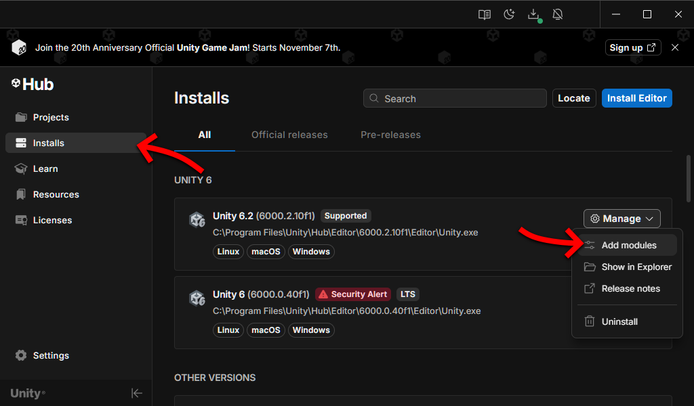
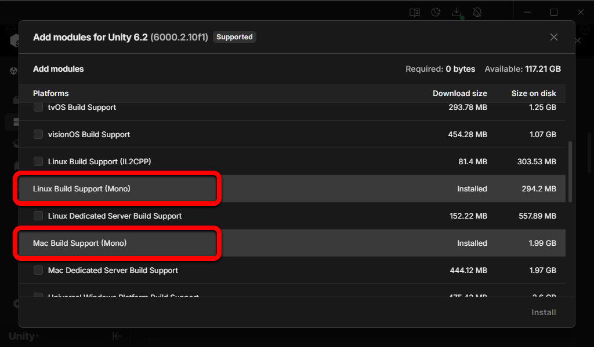
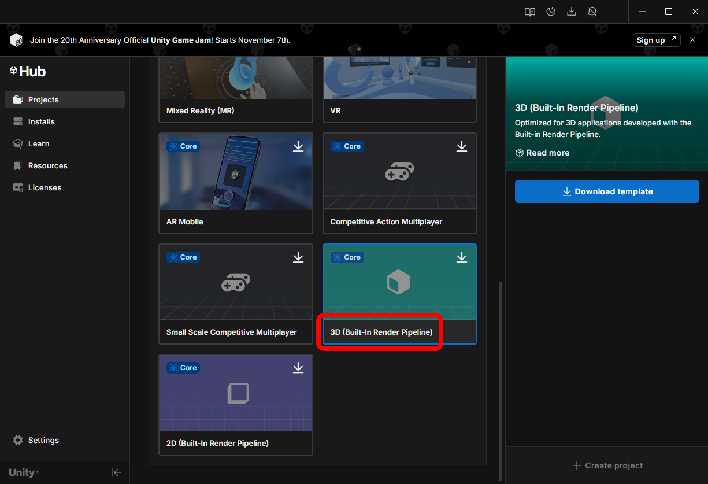

## Importing a model

Add your model files to your Unity project. You can click and drag into the Project tab of the editor, or right click a folder in the Project tab to "Show in Explorer" to navigate right to that folder.

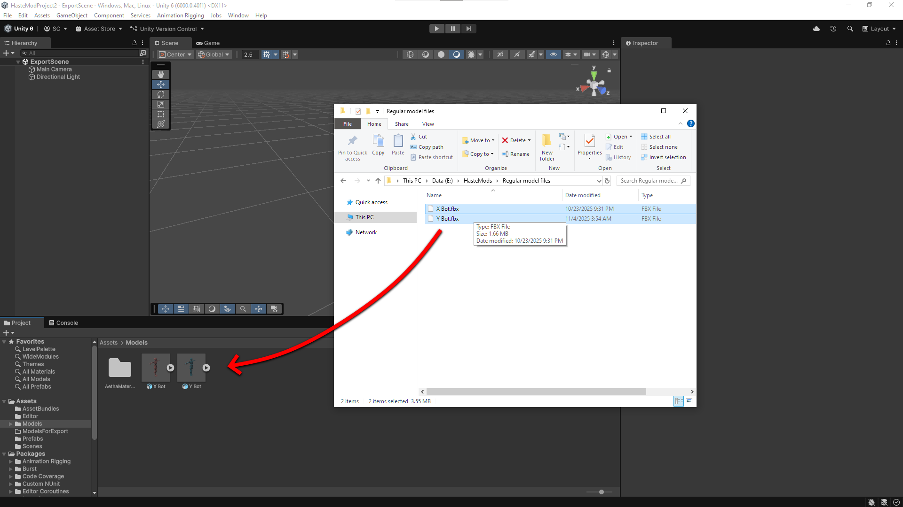

Next, go to the Rig section of the model's import settings by clicking on the model in the Project tab, then clicking the Rig button in the Inspector tab. Set the Animation Type to Humanoid. Set the Avatar Definition to Create From This Model. Then click Apply. If you're getting errors here you can click the Configure button to assign the bones manually.

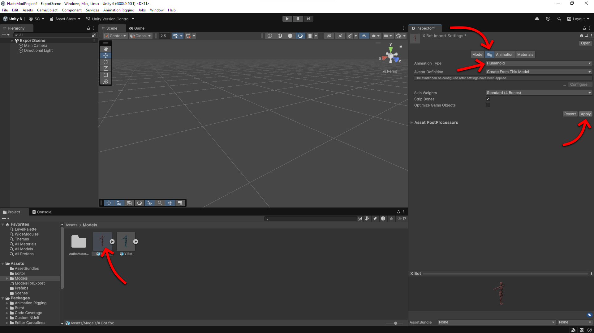

## Creating the prefab

Now drag your model into the Scene tab and reset it's Transform by right clicking Transform in the Inspector tab and choosing Reset.

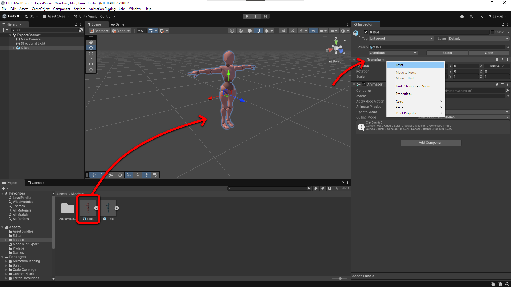

Name the game object in the inspector to YourModelName.SomeNumber like in my example "X Bot.38540". The number needs to be unique, it identifies your model against all others. You can pick anything between 100 and 2,000,000,000 or so. The name does not need to be unique, but it's the name you'll see in the skin selection screen in-game.

Drag the model from the Hierarchy tab into the Project tab to create a prefab.

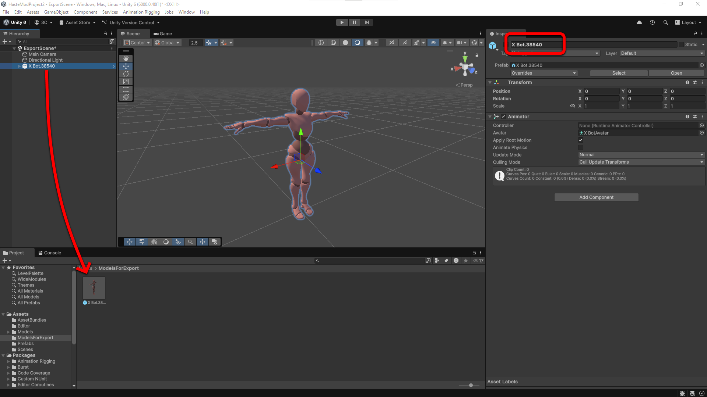

## Creating an asset bundle

Select the prefab and at the very bottom of the Inspector tab there will be two dropdown boxes to select the AssetBundle the prefab will go into. Both boxes should be all lowercase and the second box should be "hastemodel". 

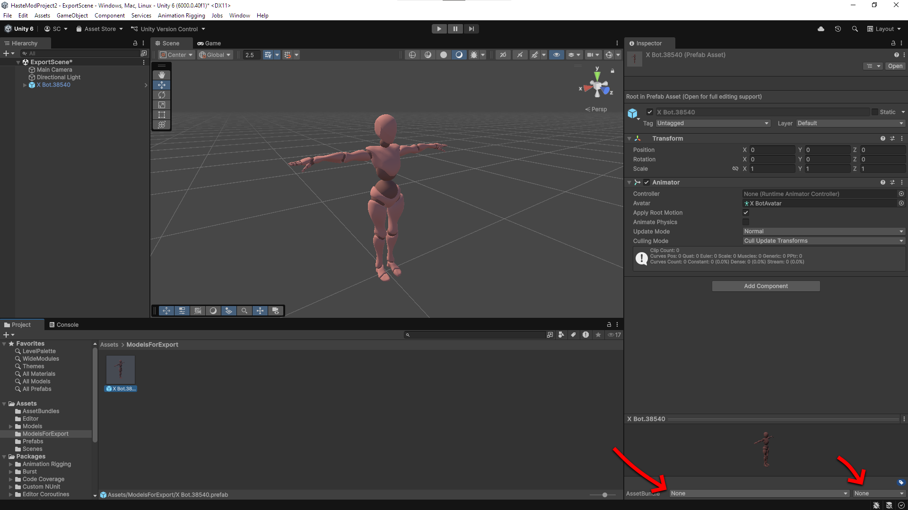

By default Unity doesn't provide a way to build asset bundles so I've included a script for you to do this easily. Add a folder called Editor to your project and put [BuildAssetBundles.cs](../UnityExtras/Editor/BuildAssetBundles.cs) in it. Unity is picky about folders named Editor, so don't skip that step!

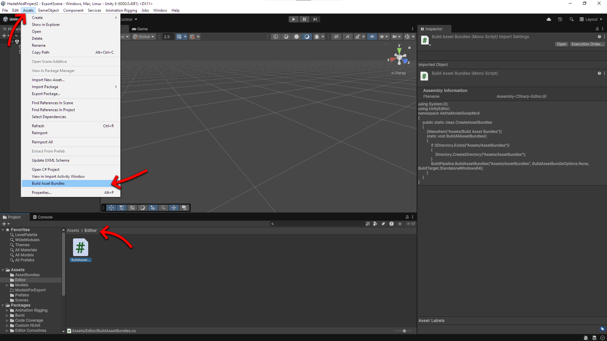

Make sure the asset bundle name looks correct then click the Build Asset Bundles option under the Assets title bar menu option.

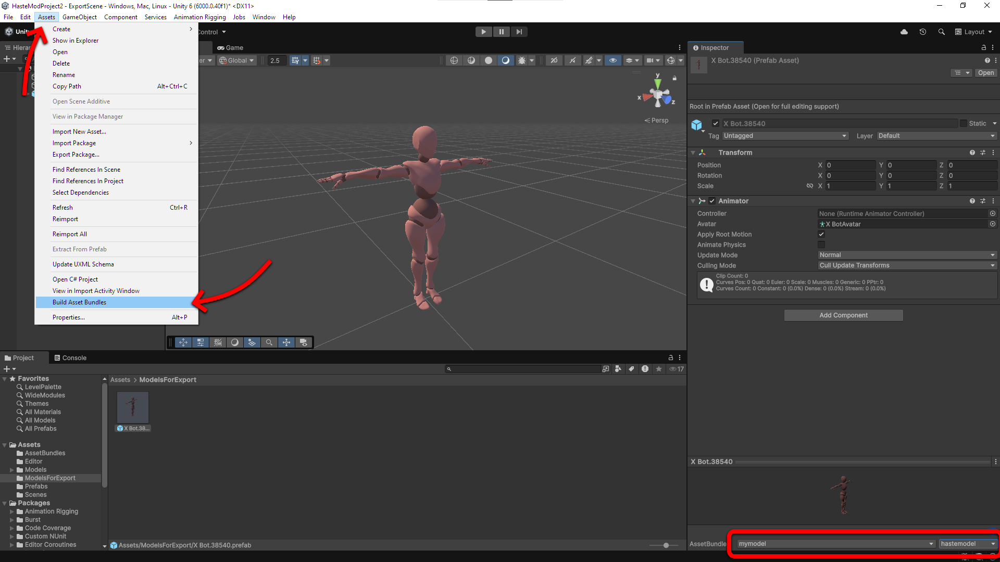

## Importing into Haste

You should now have a folder called AssetBundles/HasteModels in your Project tab. You can open it in Explorer then copy the 3 .hastemodel files to your own mod's folder.

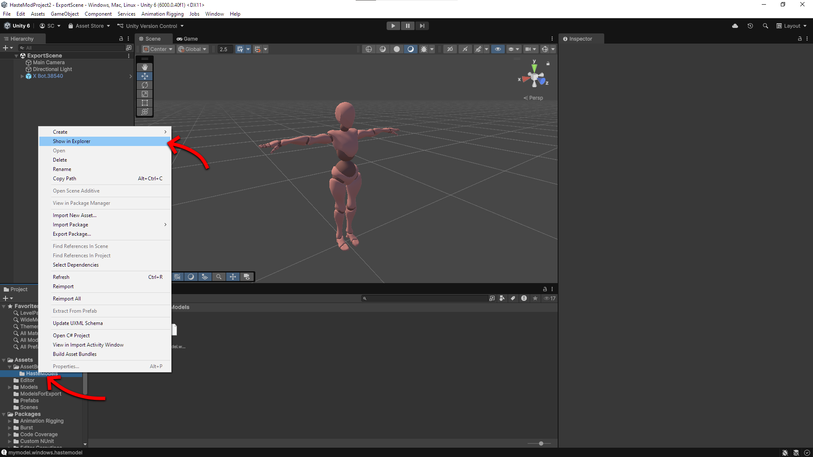

If you don't have your own mod set up yet, you can just place them in the AethaModelSwap mod folder for now which has a handy link in the in-game general settings menu.

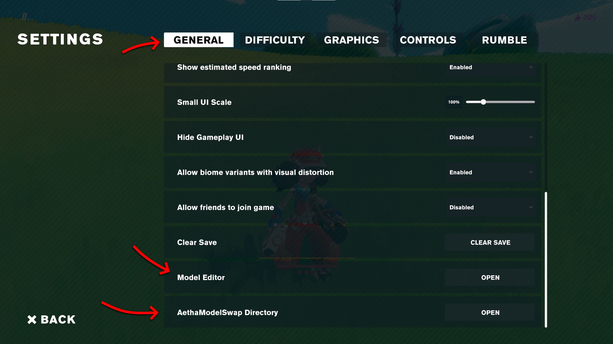

Open the model editor from the in-game general settings menu. Select your model with the arrows then when you're satisfied click Save to save the configuration file. It will be wherever you stuck the .hastemodel file and named to match the prefab's name.

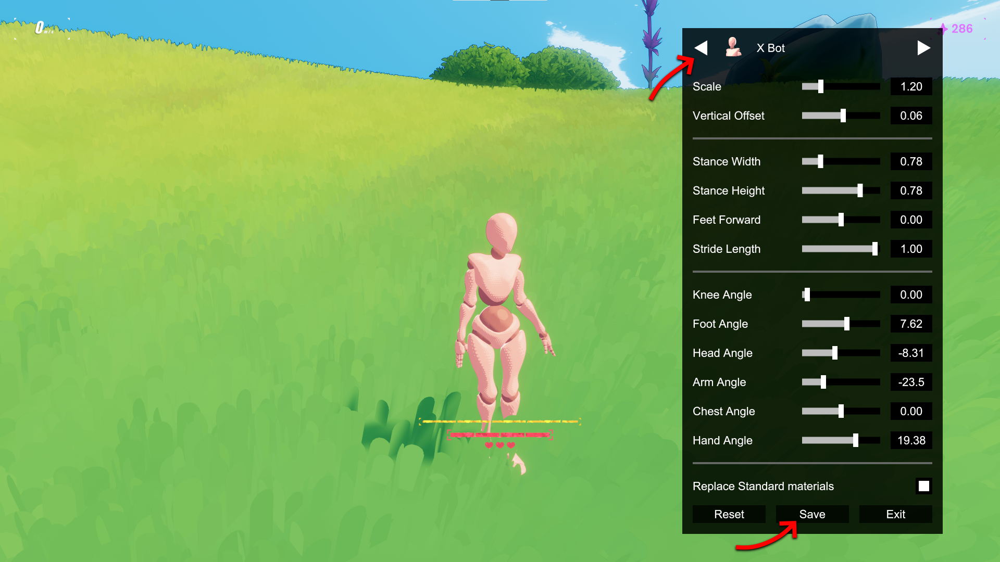

Got errors? Press F1 on your keyboard to see the console. Select AethaModelSwap in the Steam Workshop tab to see if your skin registered. You should see some messages about bundles and prefabs being loaded.

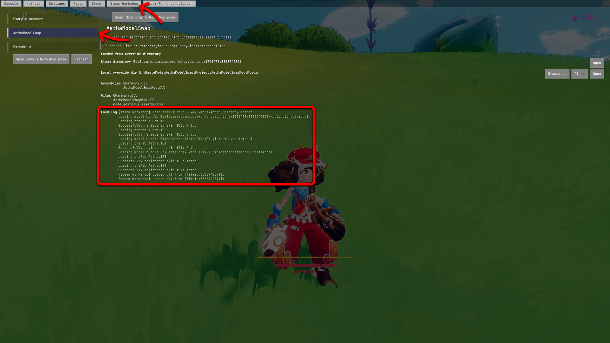

You can add a small square image file to the same folder named the same as the .json file such as "X Bot.38540.png" and it will be used as the in-game icon for the skin selection and above players' heads in multiplayer.

I'll leave uploading your own mod to learn elsewhere. Here's a handy link: https://github.com/Haste-Team/HastePlugins. The only files you need to include in a mod are the 3 .hastemodel files, your .json configuration files, and the icon image files. Make sure to set AethaModelSwap as a required item on the Steam workshop!

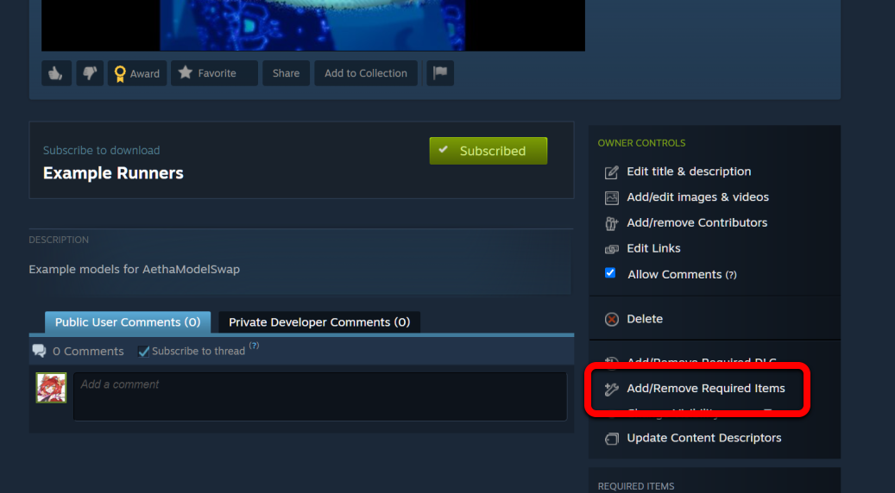
