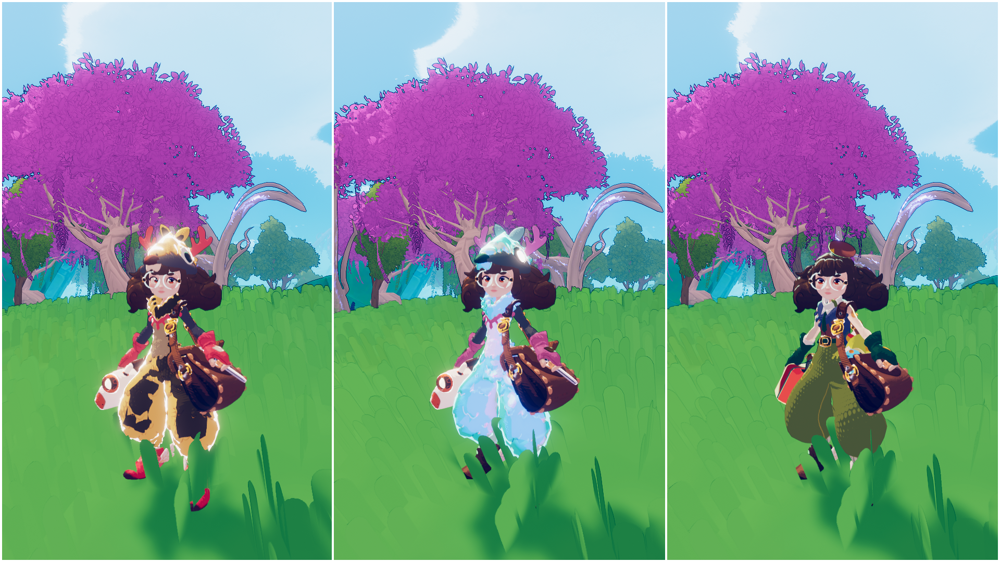

# Aetha Model Swap
This mod is a base for replacing the default Zoe model in Haste with user-imported models. Adjustments are done when the model is imported to match closely to the Zoe skeleton rig, then the model will update to match Zoe's animations. Some further configurable adjustments to arm, hand, and head angles. Then IK handles placing the feet to try and maintain a stride that matches Zoe's.

## On the Steam Workshop
The base mod: https://steamcommunity.com/sharedfiles/filedetails/?id=3508742571

Some example models: https://steamcommunity.com/sharedfiles/filedetails/?id=3599240067

## Creating models

[Here's the step-by-step guide!](Guides/StepByStep.md)

Models are exported/imported via Unity Asset Bundles. The asset bundle must have the .hastemodel filename extension. The Unity version shouldn't matter too much, but I tested with 2022.x and 6000.x. To be a valid model, the prefab name must have a number suffix (eg: Aetha.32100) to indicate which skin ID it uses. This should be totally unique otherwise it will fail to load. The model must also have an animator component with a humanoid avatar set.

There is a script for exporting the asset bundles included in this repository. Make sure BuildAssetBundles.cs is inside of a folder called Editor when putting it in Unity.

The UI icon should be a small square (256x256) .png file, named the same as the prefab (eg: Aetha.32100.png)

The configuration file can be created in game using the configuration interface (Settings -> General -> Open Model Editor)

## Multiplayer
Yep it works in multiplayer! If a player is using a custom skin that you don't have installed, they will appear as the default Zoe Courier skin. If another player doesn't have this mod, they will see you as the default skin.

## Hair jiggle physics?

It seems like this plugin is used in Haste already: https://assetstore.unity.com/packages/tools/animation/dynamic-bone-16743

If you configure the dynamic bones on your prefab in Unity they should work A-OK in Haste once exported (Thanks Mari!)

## Spark Models

Similar to exporting a skin, instead you can export any prefab named with a ".spark" suffix. If for example a prefab is named "Big Coin.spark" and exported into the .hastemodel files, it will show up in the spark model settings dropdown. Since this is clientside only, you don't need to add any ID suffix number to the prefab name.

Add any .wav sound files to your mod with this kind of naming scheme to add pickup sound effects: "Big Coin.spark.1.wav",  "Big Coin.spark.2.wav", and so on.

## Texture variants

This feature is extremely barebones! To create a texture variant equip the skin you'd like to use as the base then use (in the F1 console) `TextureSwap.CreateNewSkin Id Mode`

`Id` must be within the same range as other models, between 100 and 16,000,000 and must be completely unique.

`Mode` will modify the contents of the output .json file and can be any of:
- `Simple` - Just the most important textures (Recommended!)
- `Textures` - All textures
- `Advanced` - All properties, values all as null
- `CopyFull` - All properties, values copied from the base skin (NOT recommended)
- `CopyLess` - Most properties, cutting out the annoying ones

The textures and .json config file will be output to the AethaModelSwap skins folder, accessible through the button in Haste's General settings.

Edit the SkinPaletteConfig.json file to change the name of your skin variant, it's id, and individual material parameters if you're extremely brave. Textures must be saved as .png files.

Use `TextureSwap.Update` to reload your changes while Haste is running. You should not need to restart your game while editing your skin except to change the UI icons.

When you're done, make sure to move your skin to it's own mod folder so you don't lose any work if you uninstall AethaModelSwap! Packaging the skin variant as it's own mod just requires the .json file and textures to be included.

## Extending this mod
Other mods can register models without using the .hastemodel filename extension by calling AethaModelSwap.RegisterSkin and AethaModelSwap.RegisterToSkinManager. It's preferred to use the overloads that take Func parameters, to allow the models to lazily load only when needed.

## Thanks!
If you create any mods using this, please let me see it! You can contact me on Discord @ooseykins or on Twitter @Ooseykins or @Aetha_Azazie

